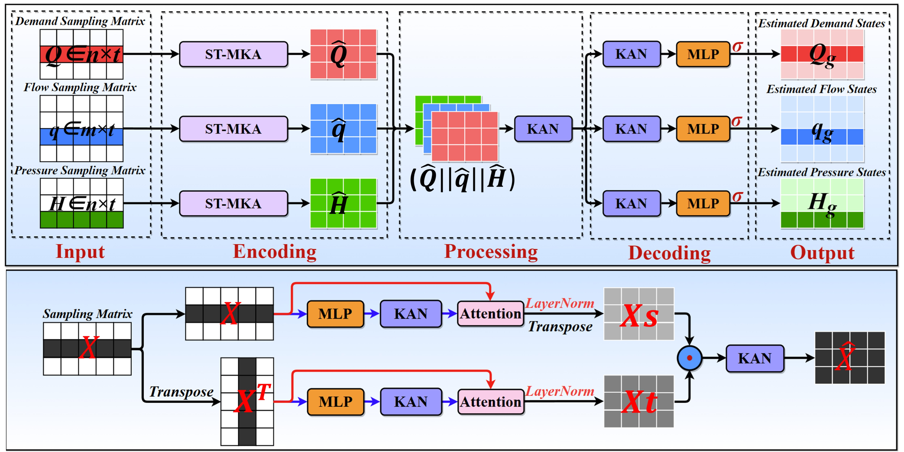

# KAN Attention Networks for Real-Time Modeling of Water Distribution Systems (KANSA)

**Paper**： [Learning Physics and Temporal Dependencies: Real-Time Modeling of Water Distribution Systems via Kolmogorov–Arnold Attention Networks] 
**Authors**： [Zekun Zou], [Zhihong Long], [Gang Xu], [Raziyeh Farmani], [Tingchao Yu], [Shipeng Chu] 

## 📜 Abstract
> **English Version**: [Real-time modeling] is vital for the intelligent management of urban water distribution systems (WDSs), enabling proactive decision-making, rapid anomaly detection, and efficient operational control. In comparison with traditional mechanistic simulators, data-driven models offer faster computation and reduced calibration demands, making them more suitable for real-time applications. However, existing models often accumulate long-term prediction errors and fail to capture the strong temporal dependencies in measured time series. To address these challenges, this study propose the Kolmogorov–Arnold Attention Network for the real-time modeling of WDSs (KANSA), which combines Kolmogorov–Arnold Networks with attention mechanisms to extract temporal dependency features through bidirectional spatiotemporal processing. Additionally, a multi-equation soft-constraint formulation embeds mass and energy conservation laws into the loss function, mitigating cumulative errors and enhancing physical consistency. Evaluations on a benchmark network and a real-world system demonstrate that KANSA achieves high-accuracy real-time estimation and pattern fidelity while maintaining engineering-grade hydraulic balance. 

## 🧠 Model Architecture
  
*Overall architecture of the [KANSA] model proposed in the paper*

## 🚀 Qucik Start

### How to Use
#### **1. The code is organized in  Notebook format**
#### **2. Just adjust the file read path to run the code**
#### **3. Description of the document**
- **dataset**   ：Simulated network dataset 
- **KANSA - PlanA**     ：Realization of the simulated network(Sensor deployment scheme A)
- **KANSA - PlanB**：Realization of the Supplyment Material Text 3
- **SM1_Text1** : Realization of the Supplyment Material Text 1
- **SM1_Text2** : Realization of the Supplyment Material Text 2

### Operation Environment
- **Python Version**： `3.12.3` 
- **CUDA Version**： `12.100` 
- **PyTorch Version**： `2.3.0+cu121` 
- **Numpy**： `1.26.4`
- **Pandas**： `2.2.2` 
###  If you have any questions, please contact us at: [*zekunzou@zju.edu.cn*]
